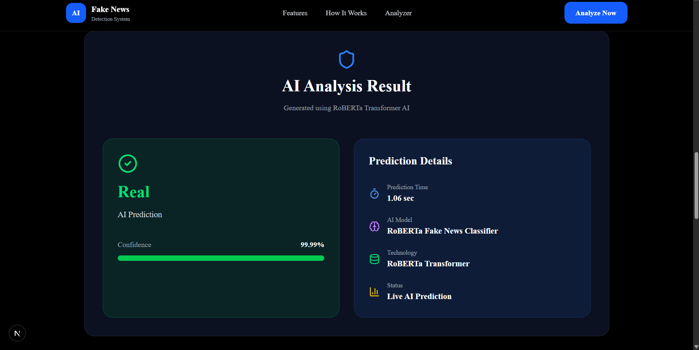
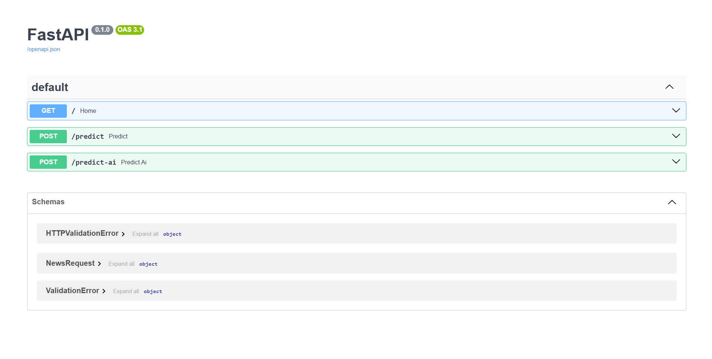

# 🤖 Fake News Detection AI

An AI-powered Fake News Detection web application built using **RoBERTa Transformer**, **FastAPI**, and **Next.js**.

---

## 📸 Screenshots

### 🏠 Homepage


---

### 🤖 AI Prediction



---

### ⚡ FastAPI Backend



---

# ✨ Features

- 🤖 RoBERTa Transformer Model
- ⚡ Real-time AI Prediction
- 📊 Confidence Score
- 🚀 FastAPI Backend
- 💻 Next.js Frontend
- 🎨 Responsive Modern UI
- 🔥 GPU Acceleration (CUDA)
- 📈 Live Prediction Time

---

# 🛠 Tech Stack

### Frontend

- Next.js
- React
- TypeScript
- Tailwind CSS

### Backend

- FastAPI
- Python

### AI

- Hugging Face Transformers
- RoBERTa
- PyTorch

---

# 📂 Project Structure

```
fake-news-detection/
│
├── backend/
│   ├── app.py
│   ├── bert_model.py
│   ├── requirements.txt
│
├── src/
│
├── public/
│
├── assets/
│   └── images/
│
└── README.md
```

---

# 🚀 Installation

## Clone Repository

```bash
git clone https://github.com/faishal782/fake-news-detection-ai.git
```

## Frontend

```bash
npm install
npm run dev
```

## Backend

```bash
cd backend

python -m venv venv

.\venv\Scripts\activate

pip install -r requirements.txt

uvicorn app:app --reload
```

---

# 📊 AI Model

- Model: RoBERTa Fake News Classifier
- Framework: Hugging Face Transformers
- Backend: FastAPI
- Frontend: Next.js
- Hardware: NVIDIA RTX 2050 GPU

---

# 🔮 Future Improvements

- 🌐 URL News Detection
- 📰 Source Credibility Analysis
- 📈 Explainable AI
- 📄 PDF News Analysis
- 🌍 Multilingual Fake News Detection

---

# 👨‍💻 Author

**Faishal**

If you like this project, give it a ⭐ on GitHub.